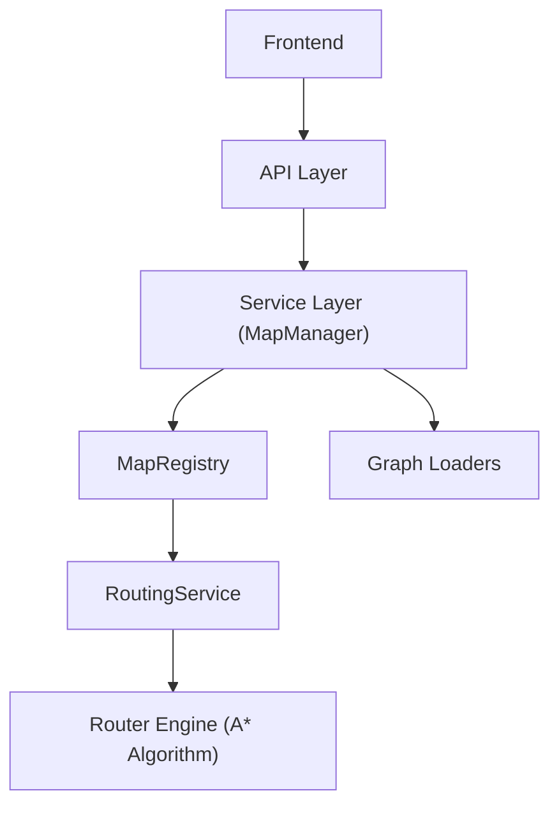

# 🧠 Architecture Overview: Route Optimization and Navigation System

## 🏗️ System Architecture Diagram

---
## 📌 Introduction

The Route Optimization and Navigation System is designed to compute optimal paths between two points using graph-based algorithms and visualize the result through an interactive front-end.

The system follows a modular architecture separating data loading, algorithmic processing, and API interaction.

---
## 🏗️ High-Level Architecture

    Frontend (Leaflet UI)
            ↓
    API Layer (FAST API, RESTful)
            ↓
    Service Layer (Map Manager)
            ↓
    Infrastructure Layer (MapRegistry, Loaders)
            ↓
    Domain Logic (RoutingService)
            ↓
    Algorithm Engine (A*)

---
## 🧩 Core Components

### 🧱 Frontend Layer

- Built using HTML, CSS, and JavaScript
- Uses Leaflet.js for map rendering
- Handles:
    - User interaction (select start/end points)
    - API requests
    - Route visualization and animation

### 🧱 API Layer

- Implemented using FastAPI
- Exposes routing endpoints
- Responsibilities:
    - Validate input
    - Trigger routing computation
    - Return structured responses

### 🧱 Service Layer

- Acts as the orchestration layer
- Connects API requests to the routing engine
- Handles:
    - Map selection
    - Graph loading
    - Execution of routing logic

### 🧱 Routing Engine

- Implements A* Algorithm
- Resposible for:
    - Path computation
    - Distance calculation
    - Node traversal

### 🧱 Graph Loaders

- Abtract data loading from different sources
- Supports:
    - OpenStreeMap (OSM) graphs
    - Custom grid-based JSON graphs

### 🧱 Data Layer

- OSM data for real-world maps
- Generated grid datasets for testing

---
## 🔄 Routing Flow

    1. User selects start and destination on the map
    2. Frontend sends a request to the API
    3. API validates and forwards request to the service layer
    4. Service selects appropriate graph loader
    5. Graph is loaded (or retrieved from cache)
    6. A* algorithm computes optimal path
    7. Coordinates are returned to frontend
    8. Frontend renders and animates the route

---
## ⚙️ Design Decisions

### ✔️ Modular Architecture

Each component is isolated, making the system easier to extend and maintain.

### ✔️ Pluggable Graph System

Supports multiple map types (OSM and grid) without changing core logic.

### ✔️ Algorithm Abstraction

Routing engine is independent of data source.

### ✔️ Separation of Concerns

Clear distinction between:
    - UI
    - API
    - Business Logic
    - Algorithm

---
## 🚧 Current Limitations

- Static edge weights (no traffic data)
- Single-route computation
- No real-time updates

---
## ⏩ Future Improvements

- Multi-route computation
- Dynamic weights (traffic simulation)
- A* exploration visualization
- Scalable backend deployement
- Performance optimizations

---
## 💡 Key Takeaways

- Demonstrates end-to-end system design
- Provides a modular and extensible architecture
